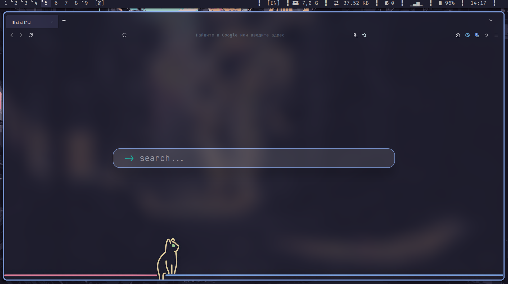

# firefox

<div align=center>

</div>

# custom firefox


# no blur ???

this will only work for [picom](https://github.com/fdev31/picom)



# extensions mtab

-   [mtab](https://addons.mozilla.org/en-US/firefox/addon/mtab/)
[github/maxhu08](https://github.com/maxhu08/mtab)
<p>Thanks maxhu08, this extension is the best!!!</p>

custom css mtab

```css
/* mtab */
#options-button {
	display: none;
}
#search-container {
	margin-top: 100px;
	padding: 10px 30px;
	border-radius: 20px !important;
	border: solid 2px #809ddb;
}
```
